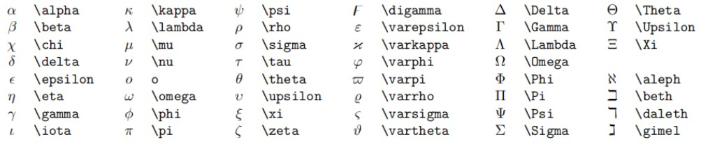

- [Markdown语法学习](#markdown语法学习)
  - [一、标题](#一标题)
  - [二、段落](#二段落)
    - [1、换行](#1换行)
    - [2、分割线](#2分割线)
  - [三、文字显示](#三文字显示)
    - [1、字体](#1字体)
    - [2、上下标](#2上下标)
  - [四、列表](#四列表)
    - [1、无序列表](#1无序列表)
    - [2、有序列表](#2有序列表)
    - [3、 任务列表](#3-任务列表)
  - [五、区块显示](#五区块显示)
  - [六、代码显示](#六代码显示)
    - [1、行内代码](#1行内代码)
    - [2、代码块](#2代码块)
  - [七、链接](#七链接)
  - [八、角注](#八角注)
  - [九、图片插入](#九图片插入)
  - [十、表格](#十表格)
  - [十一、注释](#十一注释)
  - [十二、数学公式](#十二数学公式)
    - [1、公式的插入](#1公式的插入)
    - [2、上下标](#2上下标-1)
    - [3、分式](#3分式)
    - [4、根式](#4根式)
    - [5、空格](#5空格)
    - [6、累加、累乘和积分](#6累加累乘和积分)
    - [7、括号修饰](#7括号修饰)
    - [7、多行算式对齐](#7多行算式对齐)
    - [8、省略号](#8省略号)
    - [9、方程组](#9方程组)
    - [10、矩阵](#10矩阵)
    - [11、特殊字符](#11特殊字符)
    - [12、公示编号与引用](#12公示编号与引用)
    - [13、极限](#13极限)
    - [14、字体](#14字体)

# <center>Markdown语法学习</center>

## 一、标题

语法：#（一级标题）##（二级标题）······

代码：

```{.line-numbers}
#  这是一级标题
## 这是二级标题
```

## 二、段落

### 1、换行

两个段落之间使用空行分隔
效果：

这是一个段落
这是一个段落

这是一行

这是一行

### 2、分割线

语法：---或者***
效果：

***

## 三、文字显示

### 1、字体

语法：

- 粗体: 用一对**包裹
- 删除线: 用一对~~包裹
- 下划线: 用一对u标签包裹
- 斜体：用一对*包裹
- 高亮：用一对==包裹

代码:

```{.line-numbers}
**这是粗体**
~~这是删除线~~
<u>这是下划线</u>
*这是斜体*
==这是高亮==
```

效果：
**这是粗体**
~~这是删除线~~
<u>这是下划线</u>
*这是斜体*
==这是高亮==

### 2、上下标

代码：

```{.line-numbers}
x^2^
H~2~O
```

效果:
x^2^
H~2~O

## 四、列表

### 1、无序列表

代码:

    */-/+/ +空格
效果：
1.只有同一级别：

- 苹果
- 香蕉
- 梨子

2.子集类：

- 一级分类
  - 二级分类
    - 三级分类

### 2、有序列表

代码：

    数字+.+空格
效果：

1. 有序列表1
2. 有序列表2
3. 有序列表3
   1. 嵌套有序列表
   2. 嵌套有序列表
4. 有序列表4
    - 嵌套无序列表

### 3、 任务列表

代码：

``` text {.line-numbers}
- [ ] 吃水果
- [x] 背单词
```

效果：

- [ ] 吃水果
- [x] 背单词

## 五、区块显示

语法：

    > + 回车
效果：
> 这是外部区块
    >> 这是第二层区块
    >>> 这是最内层区块

引用别人说的话：
> 这是别人说的话

## 六、代码显示

### 1、行内代码

代码：`int a = 0;`

### 2、代码块

``` {.line-numbers}
内容
```

## 七、链接

代码：

``` text {.line-numbers}
www.baidu.com
[超链接名称](链接地址)

```

效果：

<www.baidu.com>
[哔哩哔哩](https://www.bilibili.com/)
[哔哩哔哩](https://www.bilibili.com/ '提示文字')

## 八、角注

说明：对文本进行解释说明
代码：

``` text {.line-numbers}
[^文本]
[^文本]: 解释说明
```

效果：
这是一个技术[^文本]
[^文本]: 这是一个很实用的框架

## 九、图片插入

代码：``

效果：

## 十、表格

代码：

``` text {.line-numbers}
| 表头 | 表头 |
| ---- | ---- |
| 内容 | 内容 |
| 内容 | 内容 |
```

效果：
| 表头 | 表头 |
| ---- | ---- |
| 内容 | 内容 |
| 内容 | 内容 |

## 十一、注释

注释：注释不会渲染出来
<!-- 你看不见我 -->

<!-- 多行注释
就像这样 -->

## 十二、数学公式

### 1、公式的插入

1. 行中公式
代码：`单位圆 $x^2+y^2=1$`
效果：单位圆 $x^2+y^2=1$

2. 独立公式
代码：

``` text{.line-numbers}
$$
\begin{cases}
x = y + 1\\
y = 5\\
\end{cases}
$$
```

效果：
$$
\begin{cases}
x = y + 1\\
y = 5\\
\end{cases}
$$

### 2、上下标

代码：

``` text{.line-numbers}
$x^{y^2}=(1+e^x)^{-2xy^w}$
$x_1 + y_{12} = 1$
```

效果：
$x^{y^2}=(1+e^x)^{-2xy^w}$
$x_1 + y_{12} = 1$

### 3、分式

代码：

``` text{.line-numbers}
较小的行内行分数 $\displaystyle\frac{1}{2*1/2}$
展示型的分式 $\displaystyle\frac{x+1}{x-1}$
```

效果：
较小的行内行分数 $\displaystyle\frac{1}{2*1/2}$

展示型的分式 $\displaystyle\frac{x+1}{x-1}$
其中 \displaystyle 用于将行内展示转为块状展示.

### 4、根式

代码：

``` text{.line-numbers}
开平方 $\sqrt{2}$
开 $n$ 次方 $\sqrt[n]{n*3}$
```

效果：
开平方 $\sqrt{2}$
开 $n$ 次方 $\sqrt[n]{n*3}$

### 5、空格
 
数学公式中的 空格和换行 都会在编译时被忽略，想要实现「空格」的效果，需要用特别的命令。
代码：

``` text{.line-numbers}
紧贴 $a\!b$
没有空格 $ab$
小空格 $a\,b$
中等空格 $a\;b$
大空格 $a\ b$
quad 空格 $a\quad b$
两个 quad 空格 $a\qquad b$
```

效果：

紧贴 $a\!b$
没有空格 $ab$
小空格 $a\,b$
中等空格 $a\;b$
大空格 $a\ b$
quad 空格 $a\quad b$
两个 quad 空格 $a\qquad b$

### 6、累加、累乘和积分

代码：

``` text{.line-numbers}
累加 $\sum_{k=1}^n\frac{1}{k}  \quad  \displaystyle\sum_{k=1}^n\frac{1}{k}$

累乘 $\prod_{k=1}^n\frac{1}{k}  \quad  \displaystyle\prod_{k=1}^n\frac{1}{k}$

积分 $\displaystyle \int_0^1x{\rm d}x  \quad  \iint_{D_{xy}}  \quad  \iiint_{\Omega_{xyz}}$
```

效果：
累加 $\sum_{k=1}^n\frac{1}{k}  \quad  \displaystyle\sum_{k=1}^n\frac{1}{k}$

累乘 $\prod_{k=1}^n\frac{1}{k}  \quad  \displaystyle\prod_{k=1}^n\frac{1}{k}$

积分 $\displaystyle \int_0^1x{\rm d}x  \quad  \iint_{D_{xy}}  \quad  \iiint_{\Omega_{xyz}}$

### 7、括号修饰

用 \left 和 \right 可以让括号适配内部大小
代码:

``` text{.line-numbers}
圆括号 $\displaystyle \left(\sum_{k=1}^{n}\frac{1}{k} \right)^2$

方括号 $\displaystyle \left[\sum_{k=1}^{n}\frac{1}{k} \right]^2$

花括号 $\displaystyle \left\{\sum_{k=1}^{n}\frac{1}{k} \right\}^2$

尖括号 $\displaystyle \left\langle\sum_{k=1}^{n}\frac{1}{k} \right\rangle^2$
```

效果：
圆括号 $\displaystyle \left(\sum_{k=1}^{n}\frac{1}{k} \right)^2$

方括号 $\displaystyle \left[\sum_{k=1}^{n}\frac{1}{k} \right]^2$

花括号 $\displaystyle \left\{\sum_{k=1}^{n}\frac{1}{k} \right\}^2$

尖括号 $\displaystyle \left\langle\sum_{k=1}^{n}\frac{1}{k} \right\rangle^2$

### 7、多行算式对齐

代码：

``` text {.line-numbers}
居中:
$$
\begin{aligned}
y &=(x+5)^2-(x+1)^2 \\
&=(x^2+10x+25)-(x^2+2x+1) \\
&=8x+24 \\
\end{aligned}
$$
左对齐:
$
\begin{aligned}
y &=(x+5)^2-(x+1)^2 \\
&=(x^2+10x+25)-(x^2+2x+1) \\
&=8x+24 \\
\end{aligned}
$
```

效果：
居中:
$$
\begin{aligned}
y &=(x+5)^2-(x+1)^2 \\
&=(x^2+10x+25)-(x^2+2x+1) \\
&=8x+24 \\
\end{aligned}
$$

左对齐:
$
\begin{aligned}
y &=(x+5)^2-(x+1)^2 \\
&=(x^2+10x+25)-(x^2+2x+1) \\
&=8x+24 \\
\end{aligned}
$

### 8、省略号

代码：`$\cdots\quad\ldots\quad\vdots\quad\ddots$`
效果：
$\cdots\quad\ldots\quad\vdots\quad\ddots$

### 9、方程组

代码：

``` text{.line-numbers}
$$
\begin{cases}
k_{11}x_1+k_{12}x_2+\cdots+k_{1n}x_n=b_1 \\
k_{21}x_1+k_{22}x_2+\cdots+k_{2n}x_n=b_2 \\
\cdots \\
k_{n1}x_1+k_{n2}x_2+\cdots+k_{nn}x_n=b_n \\
\end{cases}
$$
```

效果：
$$
\begin{cases}
k_{11}x_1+k_{12}x_2+\cdots+k_{1n}x_n=b_1 \\
k_{21}x_1+k_{22}x_2+\cdots+k_{2n}x_n=b_2 \\
\cdots \\
k_{n1}x_1+k_{n2}x_2+\cdots+k_{nn}x_n=b_n \\
\end{cases}
$$

### 10、矩阵

代码：

``` text{.lines-numbers}
矩阵:
$$
\begin{pmatrix}
1 & 1 & \cdots & 1 \\
1 & 1 & \cdots & 1 \\
\vdots & \vdots & \ddots & \vdots \\
1 & 1 & \cdots & 1 \\
\end{pmatrix}
\quad
\begin{bmatrix}
1 & 1 & \cdots & 1 \\
1 & 1 & \cdots & 1 \\
\vdots & \vdots & \ddots & \vdots \\
1 & 1 & \cdots & 1 \\
\end{bmatrix}
$$ 
行列式: 
$$
\begin{vmatrix}
1 & 1 & \cdots & 1 \\
1 & 1 & \cdots & 1 \\
\vdots & \vdots & \ddots & \vdots \\
1 & 1 & \cdots & 1 \\
\end{vmatrix}
$$
```

效果：
矩阵:

$$
\begin{pmatrix}
1 & 1 & \cdots & 1 \\
1 & 1 & \cdots & 1 \\
\vdots & \vdots & \ddots & \vdots \\
1 & 1 & \cdots & 1 \\
\end{pmatrix}
$$

$$
\begin{bmatrix}
1 & 1 & \cdots & 1 \\
1 & 1 & \cdots & 1 \\
\vdots & \vdots & \ddots & \vdots \\
1 & 1 & \cdots & 1 \\
\end{bmatrix}
$$

行列式:

$$
\begin{vmatrix}
1 & 1 & \cdots & 1 \\
1 & 1 & \cdots & 1 \\
\vdots & \vdots & \ddots & \vdots \\
1 & 1 & \cdots & 1 \\
\end{vmatrix}
$$

### 11、特殊字符

如图：
$\Alpha \quad \beta \quad \epsilon$
更多特殊符号可上网搜索"Latex 符号表"

### 12、公示编号与引用

代码：

``` text{.line-numbers}
$$
x+2 \tag{1.2}
$$

$$
\begin{equation}
x^n+y^n=z^n
\end{equation}
$$
由公式 $(1.2)$ 可得到结论
```

效果：
$$
x+2 \tag{1.2}
$$

$$
\begin{equation}
x^n+y^n=z^n
\end{equation}
$$

由公式 $(1.2)$ 可得到结论

### 13、极限

代码：`$\lim\limits_{n\to\infin}(1+\dfrac{1}{n})^n=e$`
效果：
$\lim\limits_{n\to\infin}(1+\frac{1}{n})^n=e$

### 14、字体

1. 字体格式
语法：`${\字体{需要转换的字符}}$`
如：${\sf{Sample}}$

2. 字体颜色
语法：`${\color{颜色}{文字}}$`
如：${\color{red}{文字}}$
